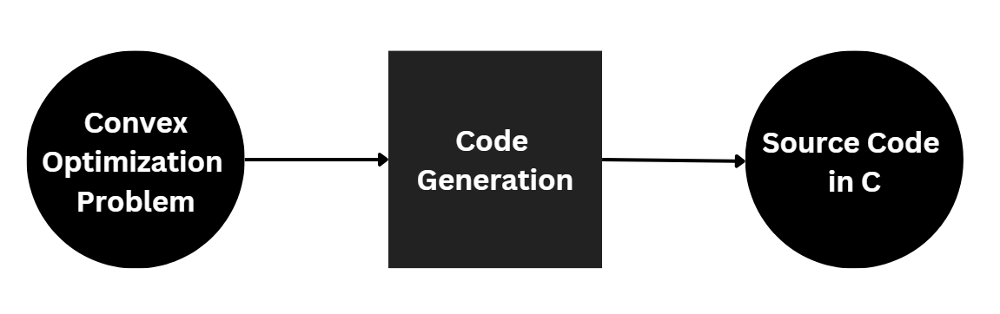

# Hackathon: LLM-integrated Code Generator for Embedded Convex Optimization

## Problem Overview:

Convex optimization, a potent tool with diverse applications from finance to healthcare and control systems, empowers engineers to find optimal solutions in complex scenarios. However, the translation of intricate mathematical expressions with convex objectives into efficient C code for embedded devices poses a considerable challenge. Engineers often find this process time-consuming and prone to errors, hindering the seamless integration of convex optimization into real-world applications.

Understanding the struggles faced by engineers, our project introduces a compelling solution: a code generation flow that not only optimizes the conversion but also resonates with the practical needs of engineers. The integration of a Large Language Model (LLM) with System Prompts aims to be the transformative force that automates and simplifies the conversion process, offering engineers a more intuitive and efficient way to harness the power of convex optimization.

## What is Convex Optimization?

A convex optimization problem is a specific type of mathematical optimization problem. Optimization problems involve finding the best solution among a set of feasible solutions. In the case of convex optimization, both the objective function to be minimized and the constraints imposed on the solution must satisfy the properties of convexity.

Here's the general form of a convex optimization problem:

In this formulation, *x* is the optimization variable, and f(*x*) is the objective function that you want to minimize. The functions *gi*(*x*) represent inequality constraints, and *hi*(*x*) represent equality constraints.

## Application of Embedded Code for Convex Optimization:

### Portfolio Optimization:

In the financial sector, embedded devices can leverage convex optimization for portfolio optimization, risk management, and algorithmic trading strategies. This enhances decision-making in financial markets.

### **Autonomous Vehicles:**

Embedded devices in autonomous vehicles can employ convex optimization for path planning, trajectory optimization, and collision avoidance. These applications help vehicles navigate efficiently while ensuring safety and adherence to traffic rules.

### **Smart Grids:**

Convex optimization is used in smart grids to optimize energy distribution, minimize transmission losses, and schedule power generation efficiently. Embedded devices in power systems can utilize convex optimization to allocate resources, balance loads, and enhance overall grid performance.

### **Healthcare Systems:**

Embedded devices in healthcare can use convex optimization for patient scheduling, resource allocation in hospitals, and optimization of medical treatments. This ensures efficient use of healthcare resources and improves patient outcomes.

### **Control Systems for Embedded Platforms:**

Convex optimization is used in designing control systems for embedded platforms, ensuring stability, performance, and energy efficiency. Applications include automotive control systems, drone flight controllers, and other embedded control systems.

## Code Generation Flow

1. User input the mathematical equation with convex objectives.
2. Large Language Model with System Prompts generate C code for embedded devices.
