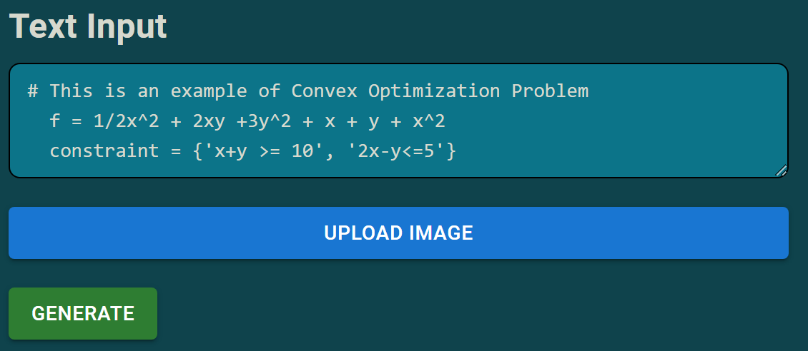
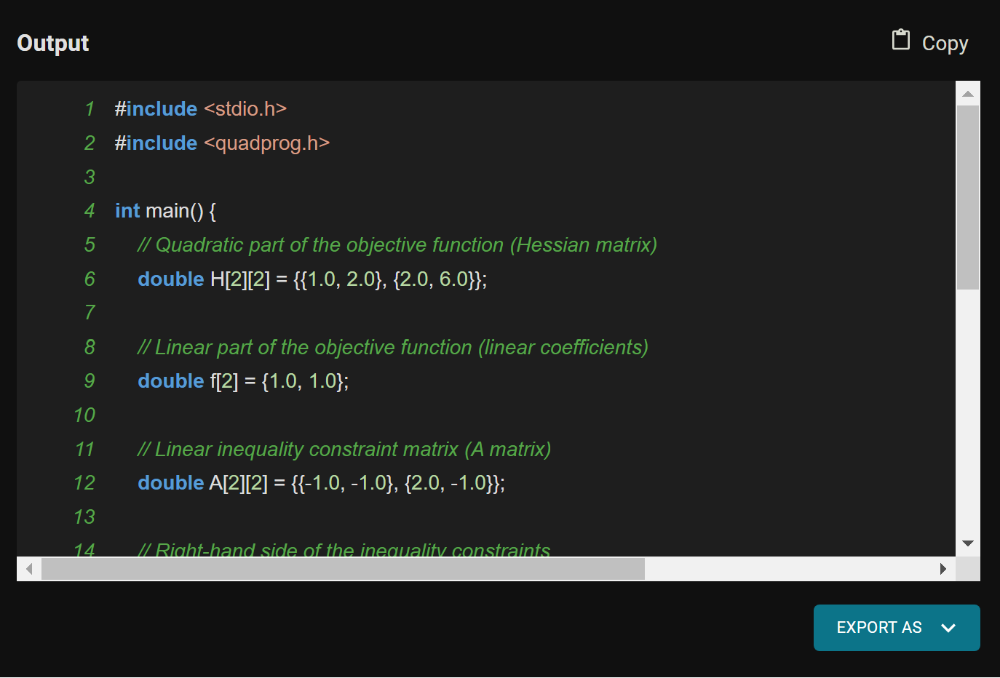

# QuickMafs: LLM-integrated Code Generator for Embedded Convex Optimization

## What is QuickMafs
QuickMafs is a LLM-integrated code generator for embedded convex optimization, addressing the challenges engineers face in translating complex mathematical expressions with convex objectives into efficient C code for embedded devices. It ultimately facilitates applications ranging from aircraft flight control systems to autonomous vehicles, portfolio optimization, healthcare systems, and smart grids.
## Problem Overview:
### What is Convex Optimization?
- Potent tool with diverse applications from finance to healthcare and control systems, empowers engineers to find optimal solutions in complex scenarios. 
### Why is Convex Optimization in Embedded Devices Important?
#### Aircraft flight control system
- Maintaining stability during atmospheric disturbances, 
#### Autonomous Vehicles:
- Path Planning, Trajectory Optimization, Collision Avoidance   
#### Portfolio Optimization:
- Portfolio Optimization, Risk Management, Algorithmic Trading Strategies
#### Healthcare Systems:
- Patient Scheduling, Resource Allocation in hospitals, Optimization of medical treatments
#### Smart Grids:
- Energy Distribution, Minimize transmission losses, schedule power generation efficiently, load balancing.   
### Problem faced by Engineer?
- The translation of intricate mathematical expressions with convex objectives into efficient C code for embedded devices is ***time-consuming and prone to errors***!
### Why use our QuickMafs
- It is a code generation flow that not only optimizes the conversion but also resonates with the practical needs of engineers. 
### What are the features of QuickMafs
- Image-to-Mathematical-Expression Conversion    
- Large Language Model with Prompt Engineering    
- Export generated code as .c or .txt    

## System Architecture
   

## Code Generation Flow
#### 1. Math Prompt

Input your math prompt in plain English expression or in the supported programming languages.
#### 2. Generate

Our system will process your input and return with the equivalent embedded system code
#### 3. Save Result

Immediately use the generated code by either copying the code directly to clipboard or saving as file.
